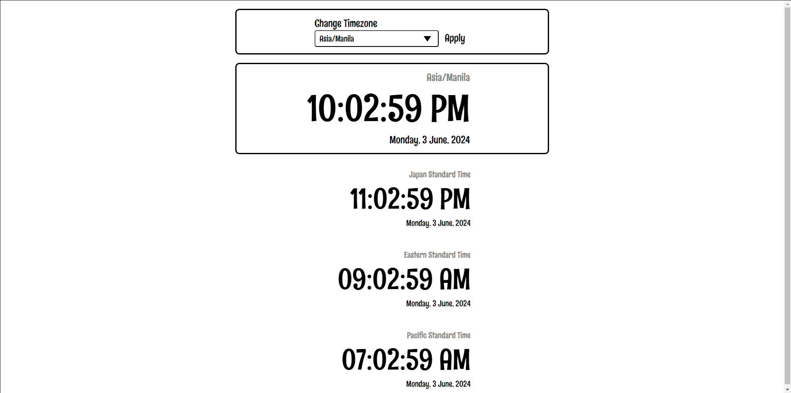
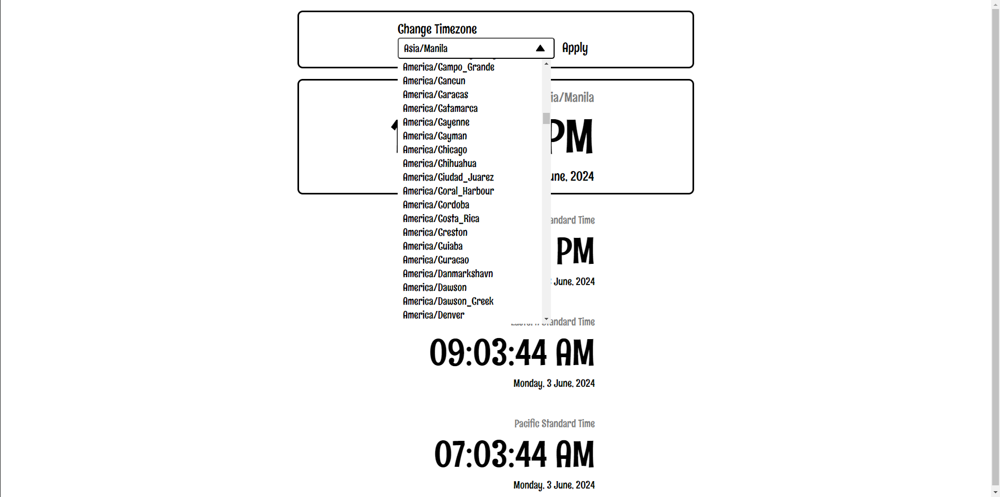

<h1 align="center">Simple Time</h1>
The simple time website shows you your current time with three additional time from JST, EST, and PST timezones. You can change the current timezone using the dropdown menu and apply button.

## How to Run
Open the index.html file in any browser to start using the Simple Time website

## Modules Used
* dayjs - To get the current time in different timezones
* browserify - Convert node.js code into usable code by the client-side

## Snapshots

